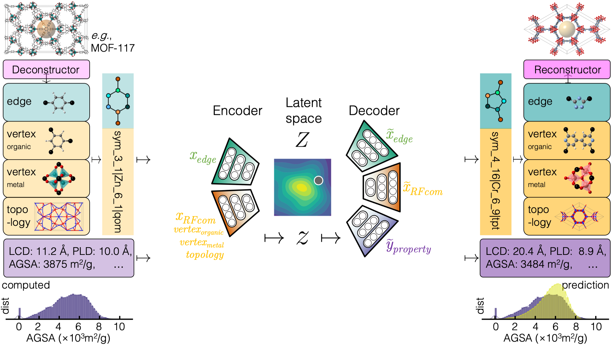

# Supramolecular Variational Autoencoder for Reticular Frameworks

SmVAE is a multi-component variational autoencoder with modules that are in charge of encoding and decoding each part of the RFcode (edge, vertices, topology). Reticular frameworks are mapped with discrete RFcodes, transferred into continuous vectors, and then transferred back. To have the latent space organized around properties of interest, we add an extra component to the model that uses labeled data.

